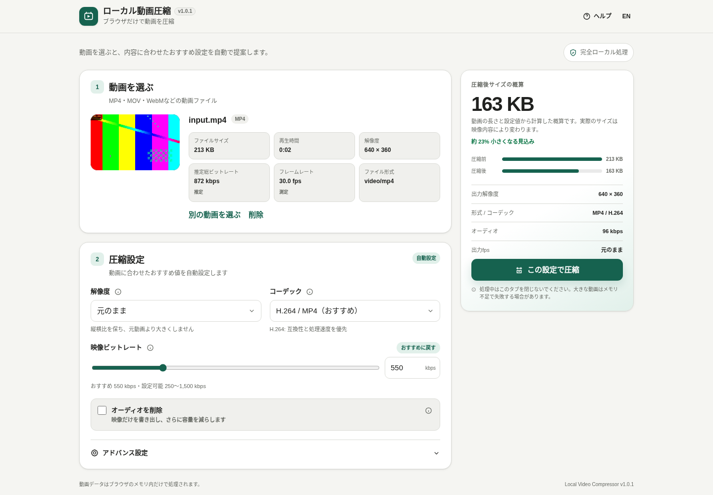

# Local Video Compressor

[](https://github.com/ttomohisa/htmlapps-video-compressor/actions/workflows/deploy-pages.yml)
[](LICENSE)
[](https://ttomohisa.github.io/htmlapps-video-compressor/)

[日本語版 README](README.ja.md)

A single-HTML video compressor that keeps video processing inside the browser and outputs **H.264 / AAC MP4**. The engine is the FFmpeg 9 compact WebAssembly build produced by [`htmlapps-ffmpeg-wasm-builder`](https://github.com/ttomohisa/htmlapps-ffmpeg-wasm-builder), without SharedArrayBuffer requirements.



## 🚀 Live demo

[Open Local Video Compressor on GitHub Pages](https://ttomohisa.github.io/htmlapps-video-compressor/)

> **CSP note:** `script-src` includes the narrow `'wasm-unsafe-eval'` permission required for WebAssembly. The broader JavaScript `'unsafe-eval'` token is not enabled, and `connect-src 'none'` blocks runtime network access.

## Features

- Fixed H.264 / AAC / MP4 output for broad playback compatibility
- Resolution changes with aspect-ratio preservation and no upscaling
- Per-video recommended video bitrate
- Output frame rate, x264 speed preset, and audio bitrate controls
- Optional audio removal
- Estimated output size
- Progress, processing log, and cancellation
- Preview, save, and share output
- Japanese and English UI
- No runtime network access
- Responsive desktop/mobile UI

## FFmpeg WASM dependency

The repository does not commit the large generated WASM binary. `dependencies.json` contains a **single pinned FFmpeg WASM Builder version**. During the build, the matching GitHub Release is downloaded and verified against its `SHA256SUMS.txt`, then `ffmpeg.js` and `ffmpeg.wasm` are embedded into the standalone HTML.

Current pin:

```json
"version": "1.0.0"
```

The runtime never downloads FFmpeg from GitHub.

## Build on Windows

Run:

```text
build-standalone.bat
```

The build creates:

```text
dist/
├─ index.html
├─ index.self-extract.html
├─ dependency-manifest.json
├─ self-extract-manifest.json
└─ .nojekyll

video-compressor.html   # copy of dist/index.html
```

Generate only the readable build with:

```powershell
.\build-standalone.ps1 -SkipSelfExtract
```

Force a fresh verified Release download with:

```powershell
.\build-standalone.ps1 -ForceDownload
```

## Update FFmpeg

When a new Builder release is ready, update one version number and rebuild with:

```text
update-ffmpeg.bat 1.0.1
```

The script updates `dependencies.json`, downloads the matching Release, verifies its SHA-256, and rebuilds the standalone files.

## Usage

1. Choose or drop a video.
2. Review the suggested resolution and bitrate.
3. Adjust frame rate, encoding speed, or audio settings when needed.
4. Select **Compress with these settings**.
5. Preview, save, or share the H.264 / AAC MP4 output.

The old H.265 / VP9 output choices and metadata-retention option were removed as part of the compact-runner migration.

## Privacy and offline architecture

- `connect-src 'none'` blocks runtime connections.
- No external CDN, analytics, ads, or remote fonts.
- Input and output video data are not persisted.
- `ffmpeg.js` and `ffmpeg.wasm` are embedded into one HTML file.
- FFmpeg runs in a dedicated Worker.
- WASM bytes are instantiated directly through `instantiateWasm`, avoiding runtime URL resolution under `file://`.
- Generated core JavaScript and the app Worker code share one Blob; no nested `importScripts()` is used.
- SharedArrayBuffer, COOP, and COEP are not required.

See [docs/ARCHITECTURE.md](docs/ARCHITECTURE.md) and [VERIFY_OFFLINE.md](VERIFY_OFFLINE.md).

## Development

Key files:

- `dependencies.json`: pinned Builder version and Release assets
- `src/index.template.html`: UI and application logic
- `build-standalone.ps1`: Release download, checksum verification, and embedding
- `update-ffmpeg.bat`: Builder version update helper
- `scripts/check-repository.ps1`: end-to-end source/build verification
- `THIRD_PARTY_NOTICES.md`: third-party licensing and corresponding source details

```powershell
powershell -ExecutionPolicy Bypass -File scripts/check-repository.ps1
```

## License

This application repository is **GPL-3.0-or-later**. The generated FFmpeg/x264 WebAssembly core from `htmlapps-ffmpeg-wasm-builder` is distributed under **GPL-2.0-or-later**.

The generated app also exposes the Builder version and corresponding-source link in its Help dialog. See [THIRD_PARTY_NOTICES.md](THIRD_PARTY_NOTICES.md).
